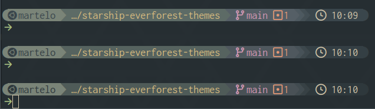

# Starship Everforest Dark (Soft / Medium / Hard)

A **powerline-style Starship prompt** using the **Everforest Dark** color palette, with toggleable **Soft**, **Medium**, and **Hard** variants.

Designed for Nerd Font icons.

This repository ships a **single `starship.toml`** with comment-based palette switching and carefully tuned module styling.

---

## ✨ Features

- 🌲 **Everforest Dark** palettes  
  - 🎨 Soft / Medium / Hard (palette-driven: toggle via comment)
- 🧱 Powerline separators
- 🧼 Git status
- 🧠 Language-aware modules (Node.js, Python, Rust, Go, Java, Kotlin, Haskell, PHP)
- 🐳 Docker context support
- ⏱ Time & command status indicators

---

## 🖼 Preview



> Shown: Everforest Dark Soft, Medium, Hard

> Exact appearance depends on terminal + font rendering.

---

## 🔤 Font Requirement (IMPORTANT)

This config **requires a Nerd Font** for icons and powerline symbols.

### Recommended
- **Inconsolata Nerd Font**

### Alternatives (also compatible)
Any Nerd Font that includes:
- Powerline symbols
- Devicons
- Font Awesome / Material icons

Examples:
- JetBrainsMono Nerd Font  
- FiraCode Nerd Font  
- Hack Nerd Font  

> ⚠️ Without a Nerd Font, icons will appear as squares or missing glyphs.

---

## 📦 Installation

### Install Starship
```sh
curl -sS https://starship.rs/install.sh | sh
```

### Install a Nerd Font
Download from: https://www.nerdfonts.com  
Set the font in your terminal emulator.

---

## 🎛 Palette Switching

At the top of `starship.toml`:

```toml
# palette = "everforest_dark_soft"
palette = "everforest_dark_medium"
# palette = "everforest_dark_hard"
```

Comment/uncomment **exactly one** line.

---

## 📜 License

MIT
